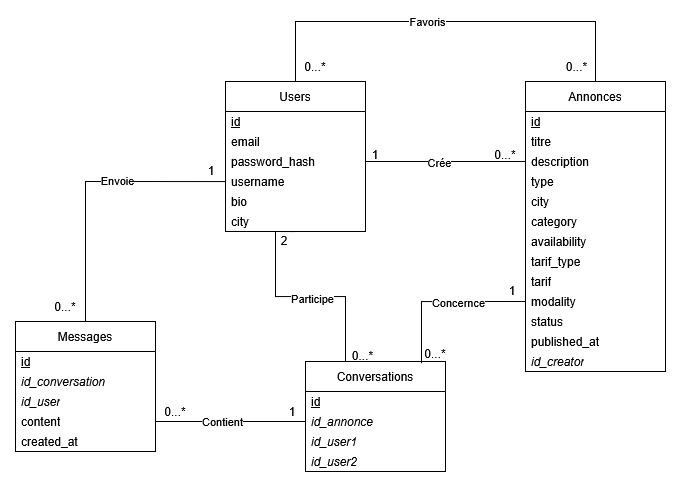

# TaskMan

## FR

TaskMan est une plateforme web de mise en relation entre particuliers.

Les utilisateurs peuvent publier des annonces et contacter le créateur d'une annonce via une messagerie interne en temps réel.

---

### Architecture

- Frontend SPA en Vue.js
- Backend REST API avec Express.js
- Base de données PostgreSQL
- Communication via API JSON

---

### Technologies utilisées

#### Backend

- Node.js
- Express.js
- Sequelize
- PostgreSQL
- Authentification JWT
- Argon2

#### Frontend

- Vue.js
- Vue Router
- Axios

---

### Prérequis

- Node.js >= 20
- PostgreSQL >= 15
- npm >= 10

---

### Fonctionnalités

#### Utilisateurs

- Inscription
- Connexion avec JWT
- Modification du profil
- Consultation de son profil et du profil d'autres utilisateurs

#### Annonces

- Création d’annonce
- Modification d’annonce
- Suppression d’annonce
- Consultation d’une annonce
- Liste des annonces
- Filtrage des annonces :
  - recherche texte via titre/description
  - type (offre/demande)
  - catégorie
  - ville
- Tri :
  - plus récent
  - prix croissant
  - prix décroissant
- Pagination personnalisable de la liste des annonces

#### Messagerie

- Création d'une conversation avec l'auteur d'une annonce
- Liste des conversations d'un utilisateur
- Envoi de messages en temps réel
- Consultation des messages d'une conversation

#### Favoris (bonus)

- Ajouter une annonce en favoris
- Supprimer une annonce de ses favoris
- Consulter les annonces en favoris

---

### Structure du projet

```txt
Taskman-front/
Taskman-back/
```

---

### Installation du projet

#### Backend

Se placer dans le dossier backend :

```bash
cd Taskman-back
```

Installer les dépendances :

```bash
npm install
```

Créer un fichier `.env` à la racine du projet backend.

Exemple :

```env
PORT=3000

DB_HOST=localhost
DB_PORT=5432
DB_NAME=taskman
DB_USER=postgres
DB_PASSWORD=password

JWT_SECRET=secret
JWT_EXPIRES_IN=7d
```

Pour faciliter le fonctionnement du projet, il est conseillé de conserver le port `3000`.

La base de données utilisée est une base **PostgreSQL**.

Créer la base de données puis exécuter le script :

```txt
Taskman-back/src/utils/create_db.sql
```

Afin d'avoir un jeu de données de test, il est possible d'exécuter les INSERT présents dans :

```txt
Taskman-back/src/utils/populate.sql
```

Lancer le backend :

```bash
npm run dev
```

---

#### Frontend

Se placer dans le dossier frontend :

```bash
cd Taskman-front
```

Installer les dépendances :

```bash
npm install
```

Lancer le frontend :

```bash
npm run dev
```

Pour faciliter le fonctionnement du projet, il est conseillé de conserver le port `5173`.

---

### Comptes de test

#### Utilisateur 1

```txt
username : toto
email : toto@exemple.com
password : CPT_cpt_1234++
```

#### Utilisateur 2

```txt
username : tata
email : tata@exemple.com
password : CPT_cpt_5678++
```

Les autres comptes présents dans le script de test utilisent le mot de passe :

```txt
CPT_cpt_1234++
```

---

### Diagramme de classe de la base de données



---

## ENG

TaskMan is a web platform designed to connect individuals through service listings.

Users can publish listings and contact listing creators through a real-time internal messaging system.

---

### Architecture

- Vue.js SPA frontend
- Express.js REST API backend
- PostgreSQL database
- JSON API communication

---

### Technologies Used

#### Backend

- Node.js
- Express.js
- Sequelize
- PostgreSQL
- JWT Authentication
- Argon2

#### Frontend

- Vue.js
- Vue Router
- Axios

---

### Requirements

- Node.js >= 20
- PostgreSQL >= 15
- npm >= 10

---

### Features

#### Users

- User registration
- JWT authentication
- Profile editing
- View personal and other users' profiles

#### Listings

- Create listings
- Edit listings
- Delete listings
- View listing details
- Browse listings
- Listing filters:
  - text search via title/description
  - type (offer/request)
  - category
  - city
- Sorting:
  - most recent
  - ascending price
  - descending price
- Customizable pagination

#### Messaging

- Create conversations with listing creators
- View user conversations
- Real-time messaging
- View conversation messages

#### Favorites (Bonus)

- Add listings to favorites
- Remove listings from favorites
- View favorite listings

---

### Project Structure

```txt
Taskman-front/
Taskman-back/
```

---

### Project Installation

#### Backend

Go to the backend folder:

```bash
cd Taskman-back
```

Install dependencies:

```bash
npm install
```

Create a `.env` file at the root of the backend project.

Example:

```env
PORT=3000

DB_HOST=localhost
DB_PORT=5432
DB_NAME=taskman
DB_USER=postgres
DB_PASSWORD=password

JWT_SECRET=secret
JWT_EXPIRES_IN=7d
```

For easier project configuration, it is recommended to keep port `3000`.

The project uses a **PostgreSQL** database.

Create the database and execute:

```txt
Taskman-back/src/utils/create_db.sql
```

To populate the database with test data, execute the INSERT statements from:

```txt
Taskman-back/src/utils/populate.sql
```

Run the backend:

```bash
npm run dev
```

---

#### Frontend

Go to the frontend folder:

```bash
cd Taskman-front
```

Install dependencies:

```bash
npm install
```

Run the frontend:

```bash
npm run dev
```

For easier project configuration, it is recommended to keep port `5173`.

---

### Test Accounts

#### User 1

```txt
username : toto
email : toto@exemple.com
password : CPT_cpt_1234++
```

#### User 2

```txt
username : tata
email : tata@exemple.com
password : CPT_cpt_5678++
```

All other test accounts use the following password:

```txt
CPT_cpt_1234++
```

---

### Database Class Diagram

